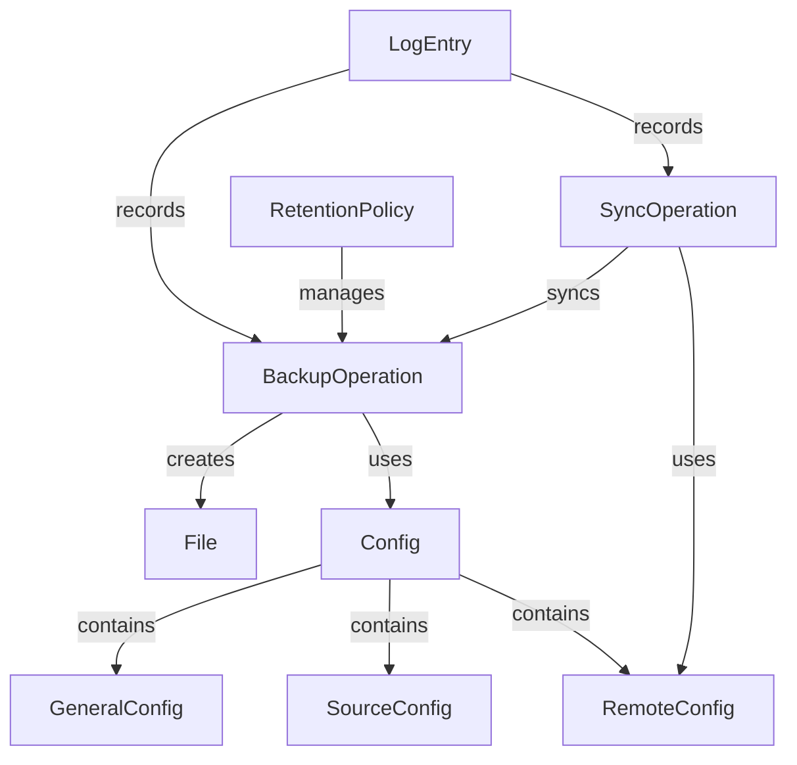

# Data Model: Personal Data Backup System

**Feature**: 001-backup-system
**Created**: 2026-01-15
**Status**: Completed

## Core Entities

### 1. Configuration

**Purpose**: Stores user preferences, encryption keys, and system settings

**Fields**:

```rust
pub struct Config {
    pub general: GeneralConfig,
    pub sources: HashMap<String, SourceConfig>,
    pub remotes: HashMap<String, RemoteConfig>,
}
```

**Sub-entities**:

#### GeneralConfig

```rust
pub struct GeneralConfig {
    pub password_hint: String,
    pub password_key: Option<String>, // Encrypted at rest
    pub max_retention: u8, // 1-10
    pub http_proxy: Option<String>,
    pub https_proxy: Option<String>,
    pub no_proxy: Option<String>,
    pub log_level: String, // debug, info, warn, error
}
```

**Validation**:
- `max_retention`: 1 <= value <= 10
- `password_key`: If present, must be valid encrypted string
- Proxies: Must be valid URL format if present

#### SourceConfig

```rust
pub struct SourceConfig {
    pub enabled: bool,
    pub source_type: SourceType, // firefox, folder
    pub dir: PathBuf,
    pub frequency: BackupFrequency, // daily, weekly
    pub last_backup: Option<DateTime<Utc>>,
    pub backup_count: u32,
}
```

**Validation**:
- `dir`: Must exist and be readable
- `frequency`: Must be valid enum value
- If `enabled`, `dir` must be valid

#### RemoteConfig

```rust
pub struct RemoteConfig {
    pub enabled: bool,
    pub remote_type: RemoteType, // dropbox, onedrive, ssh
    pub api_key: Option<String>, // Encrypted at rest
    pub username: Option<String>,
    pub ipaddr: Option<String>,
    pub port: Option<u16>,
    pub http_proxy: Option<String>,
    pub https_proxy: Option<String>,
    pub last_sync: Option<DateTime<Utc>>,
}
```

**Validation**:
- For cloud remotes: `api_key` must be present if enabled
- For SSH: `username`, `ipaddr` must be present if enabled
- Port: Must be valid range if present

**State Transitions**:
- `enabled: false` → `enabled: true`: Requires validation of all fields
- Configuration changes: Update `updated_at` timestamp

---

### 2. BackupOperation

**Purpose**: Represents a single backup operation with metadata

```rust
pub struct BackupOperation {
    pub id: Uuid,
    pub source_type: SourceType,
    pub source_id: String,
    pub started_at: DateTime<Utc>,
    pub completed_at: Option<DateTime<Utc>>,
    pub status: BackupStatus,
    pub file_path: PathBuf,
    pub file_size: u64,
    pub password_hash: String,
    pub encryption_algorithm: String, // "AES-256-GCM"
    pub compression_algorithm: String, // "7zip"
    pub error: Option<String>,
}
```

**Status Enum**:
```rust
pub enum BackupStatus {
    Pending,
    InProgress,
    Completed,
    Failed,
    Skipped, // e.g., source not available
}
```

**Validation**:
- `file_path`: Must be absolute path in temp directory
- `password_hash`: Must be valid hash format
- `file_size`: Must match actual file size
- `started_at` <= `completed_at` (if completed)

**State Transitions**:
1. `Pending` → `InProgress`: When backup starts
2. `InProgress` → `Completed`: On successful completion
3. `InProgress` → `Failed`: On error with error message
4. Any → `Skipped`: If preconditions not met

---

### 3. SyncOperation

**Purpose**: Represents synchronization of backup files to remote storage

```rust
pub struct SyncOperation {
    pub id: Uuid,
    pub backup_id: Uuid,
    pub remote_type: RemoteType,
    pub remote_id: String,
    pub started_at: DateTime<Utc>,
    pub completed_at: Option<DateTime<Utc>>,
    pub status: SyncStatus,
    pub bytes_transferred: u64,
    pub error: Option<String>,
    pub retry_count: u8,
}
```

**Status Enum**:
```rust
pub enum SyncStatus {
    Pending,
    InProgress,
    Completed,
    Failed,
    RetryPending,
}
```

**Validation**:
- `backup_id`: Must reference existing backup
- `bytes_transferred`: Must be <= backup file size
- `retry_count`: Must be <= max retry limit

**State Transitions**:
1. `Pending` → `InProgress`: When sync starts
2. `InProgress` → `Completed`: On successful transfer
3. `InProgress` → `Failed`: On permanent error
4. `Failed` → `RetryPending`: If retry is possible
5. `RetryPending` → `InProgress`: On retry attempt

---

### 4. LogEntry

**Purpose**: Detailed record of system operations for auditing and debugging

```rust
pub struct LogEntry {
    pub timestamp: DateTime<Utc>,
    pub level: LogLevel,
    pub module: String,
    pub message: String,
    pub context: HashMap<String, String>, // Additional context data
    pub session_id: Option<Uuid>, // For correlating related operations
}
```

**LogLevel Enum**:
```rust
pub enum LogLevel {
    Error,
    Warn,
    Info,
    Debug,
    Trace,
}
```

**Validation**:
- `timestamp`: Must be valid and recent
- `message`: Must not contain sensitive data
- `context`: Keys/values must be sanitized

**Retention**:
- Log files rotated daily
- Max 7 days of logs retained
- Max 10MB per log file

---

### 5. FirefoxProfileData

**Purpose**: Represents exported Firefox profile data

```rust
pub struct FirefoxProfileData {
    pub profile_path: PathBuf,
    pub bookmarks: Vec<Bookmark>,
    pub passwords: Vec<SavedPassword>,
    pub export_timestamp: DateTime<Utc>,
    pub firefox_version: Option<String>,
}
```

**Sub-entities**:

#### Bookmark
```rust
pub struct Bookmark {
    pub id: i64,
    pub title: String,
    pub url: String,
    pub date_added: DateTime<Utc>,
    pub last_modified: DateTime<Utc>,
    pub tags: Vec<String>,
    pub folder: Option<String>,
}
```

#### SavedPassword
```rust
pub struct SavedPassword {
    pub id: String,
    pub hostname: String,
    pub username: String,
    pub password: String, // Encrypted in memory
    pub date_created: DateTime<Utc>,
    pub date_last_used: DateTime<Utc>,
}
```

**Validation**:
- `profile_path`: Must be valid Firefox profile directory
- URLs: Must be valid format
- Passwords: Must be encrypted when stored

---

### 6. RetentionPolicy

**Purpose**: Manages backup version retention and cleanup

```rust
pub struct RetentionPolicy {
    pub source_type: SourceType,
    pub max_versions: u8, // 1-10
    pub current_versions: Vec<BackupOperation>,
}
```

**Methods**:
- `needs_cleanup() -> bool`: Check if max_versions exceeded
- `get_oldest_backup() -> Option<BackupOperation>`: Find backup to remove
- `apply_policy() -> Vec<BackupOperation>`: Clean up old backups

**Validation**:
- `max_versions`: Must be 1-10
- `current_versions`: Must be sorted by timestamp (newest first)

---

## Relationships



## Data Flow

### Backup Process

1. **Read Config**: Load configuration from file
2. **Validate Sources**: Check source availability
3. **Collect Data**: Export Firefox data or copy folder contents
4. **Compress**: Apply 7zip compression
5. **Encrypt**: Apply AES-256 encryption with PasswordHash
6. **Store**: Save to temp directory
7. **Log**: Record backup operation
8. **Apply Retention**: Clean up old backups if needed

### Sync Process

1. **Read Config**: Load remote configurations
2. **Find Backups**: Identify backups needing sync
3. **Transfer**: Upload to remote storage
4. **Verify**: Check transfer integrity
5. **Log**: Record sync operation
6. **Handle Errors**: Retry or log failures

## Storage Locations

- **Config**: `$HOME/.config/briefcase.toml`
- **Temp Files**: `$HOME/.cache/briefcase/temp/*.7z`
- **Logs**: `$HOME/.cache/briefcase/log/briefcase.log`
- **State**: In-memory during operation, persisted in config

## Security Considerations

### Sensitive Data Handling

- **PasswordKey**: Encrypted at rest, zeroized in memory after use
- **PasswordHash**: One-time use, not stored permanently
- **Cloud Credentials**: Encrypted in config file
- **Firefox Passwords**: Encrypted during export process

### Data Validation

- All paths validated before use
- File sizes checked against limits
- Configuration validated on load
- Input sanitized for logging

### Encryption Requirements

- AES-256-GCM for all sensitive data
- Random nonces for each encryption operation
- Authentication tags verified on decryption
- Key derivation using PBKDF2 with high iteration count

## Error Handling

### Common Error Conditions

- **ConfigError**: Invalid configuration format or values
- **SourceError**: Source not available or inaccessible
- **EncryptionError**: Encryption/decryption failure
- **SyncError**: Network or remote storage failure
- **RetentionError**: Cleanup operation failure

### Error Recovery

- **Transient errors**: Automatic retry with exponential backoff
- **Permanent errors**: Log and skip operation
- **Critical errors**: Fail fast with detailed logging

## Testing Data Models

### Test Scenarios

1. **Config Validation**: Test invalid configurations are rejected
2. **Backup Lifecycle**: Test all state transitions
3. **Sync Retry Logic**: Test retry behavior
4. **Retention Policy**: Test cleanup operations
5. **Error Conditions**: Test error handling paths

### Test Data

- Valid and invalid configuration files
- Sample Firefox profile data
- Test files of various sizes (1-10MB)
- Mock remote storage endpoints

This data model supports all functional requirements while maintaining security, performance, and constitution compliance.